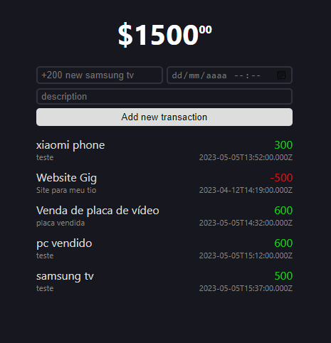

# Money Tracker App

Uma aplicação feita para gerenciar nossos gastos diários.

Foi criada utilizando o padrão <strong>MERN</strong> Stack: 
- [MongoDB](https://www.mongodb.com/atlas/database) 
- [Express](https://expressjs.com/pt-br/)
- [React](https://react.dev/)  
- [Node](https://nodejs.org/en)

Captura de tela: 

---

## Possíveis Melhorias

O app já está totalmente funcional,  
porém aqui segue uma lista de sugestões que podem ser implementadas:

- Editar os gastos;
- Deletar algum item da lista;
- Colocar ícones;
- Pode filtrar os gastos mensais/semanais/diários;

###### A criatividade é o limite!

---

## Dicas de uso:

**Criar um projeto base em react no diretório atual:**
>npm create react-app .

**Executar o server / compilador do React**
> npm start

**Rodar o server do Express:**
> node index.js

**Dependência usadas nesse projeto:**

Nome | Função
---- | ------
Cors | Protocolo de comunicação com o banco
Dotenv | Processa variáveis de ambiente
Express | Framework do Node.js
Mongoose | Conexão com o banco de dados
